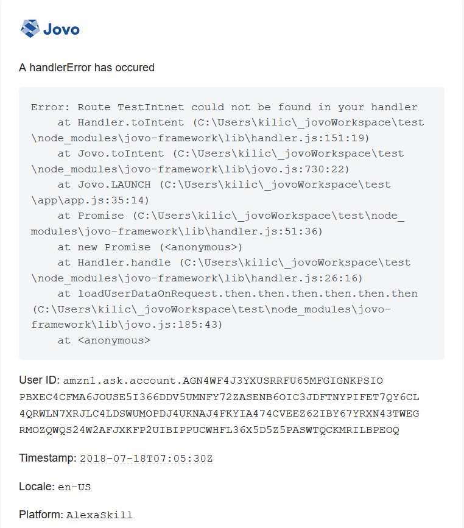
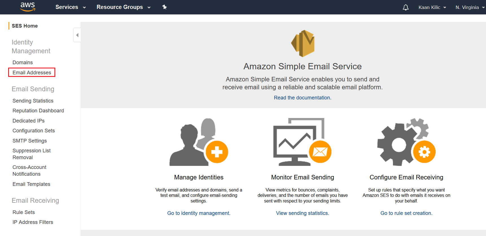
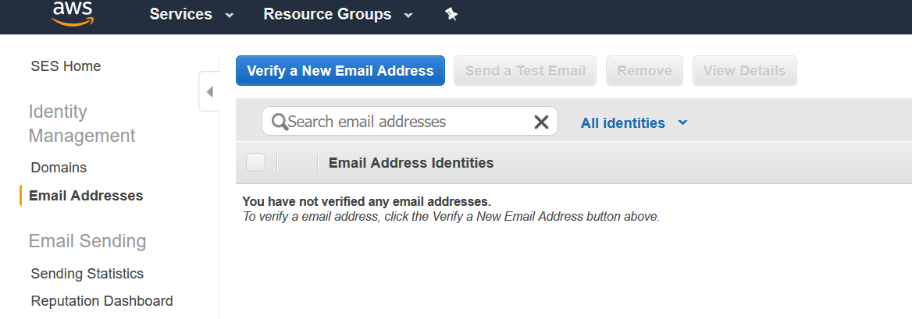

# Installation

> If you are using the Jovo Framework version < 2.0.0, please checkout the v1 branch [here](https://github.com/KaanKC/jovo-plugin-error-email/tree/v1)

```sh
$ npm install jovo-plugin-error-email --save
```

In your Jovo project:

```javascript
const {EmailErrorPlugin} = require('jovo-plugin-error-email');

const app = new App();

app.use(
    // other plugins, platforms, etc.
    new EmailErrorPlugin()
);
```

```javascript
module.exports = {
    // other configurations
    plugin: {
        EmailErrorPlugin: {
            fromEmail: 'fromEmail', // required
            toEmail: 'toEmail', // required
            subject: 'subject',
            awsConfig: {
                accessKeyId: 'access_key_id', // required
                secretAccessKey: 'secret_access_key', // required
                region: 'region' // required
            },
            smtpConfig: {
                host: 'host', // required
                port: 'port', // required
                auth: {
                    user: 'user', // required
                    pass: 'password', // required
                }
            }
    }
        },
        // other plugins
    }
};
```

The plugin works with any [SMTP Server](https://nodemailer.com/smtp/) or [Amazon Simple Email Service](https://aws.amazon.com/ses/) and [nodemailer](https://nodemailer.com/about/).

## Amazon Simple Email Service

If you choose this option it is not necessary to fill the SMTP Server configuration.

As you saw above you need to provide the credentials to an AWS account, which has to have the following policy attached:

```javascript
{
    "Statement": [
        {
            "Effect": "Allow",
            "Action": "ses:SendRawEmail",
            "Resource": "*"
        }
    ]
}
```

The email, which will be used to send out the messages, has to be verified!

Go to the `Email Addresses` tab on the AWS SES landing page:



and click on `Verify a New Email Address`:



After typing in your email address, you will receive a confirmation email and you're good to go.

## SMTP Server

As you saw earlier, you need to provide the parameters to configure SMTP Server and you don't need to fill the AWS configuration.

```javascript
    smtpConfig: {
        host: 'host', // required
        port: 'port', // required
        auth: {
            user: 'user', // required
            pass: 'password', // required
        }
    }
```

# License

MIT